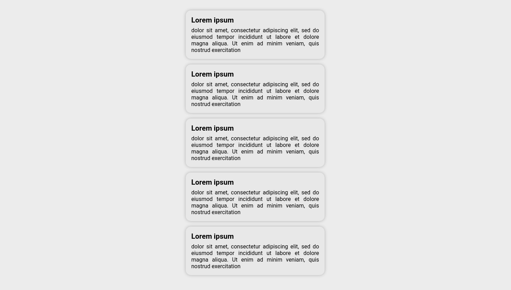

# March - Card list

## Sobre

A aplicação apresenta uma lista de cards. Desenvolvida usando [Create React App](https://github.com/facebook/create-react-app) e Typescript.

## Como inicializar localmente

Primeiro clone o repositório em sua maquina.

### `yarn`

Ira instalar as dependências necessárias.

### `yarn start`

Roda o app em ambiente de desenvolvimento.\
Abra [http://localhost:3000](http://localhost:3000) para visualizar no browser.
